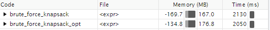
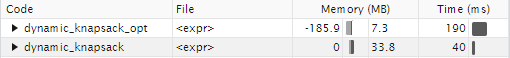
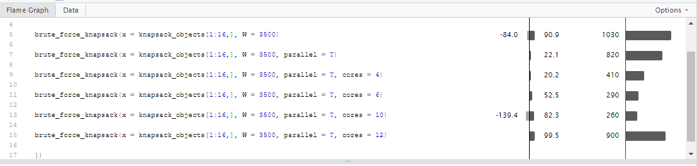

```{r, include = FALSE}
knitr::opts_chunk$set(
  collapse = TRUE,
  comment = "#>"
)
```

```{r setup}
library(solveKnapsack)
library(profvis)
library(parallel)
```

# Knapsack Problem

> According to Wikipedia 2023, the knapsack problem is the following problem in combinatorial optimization:
>
> *Given a set of items, each with a weight and a value, determine which items to include in the collection so that the total weight is less than or equal to a given limit and the total value is as large as possible.*
>
> Read more at: <https://en.wikipedia.org/wiki/Knapsack_problem#>

## Algorithms

### Brute force

> The most basic, and least efficient, algorithm is the brute force algorithm. This approach will check all 2\^n possible combinations of items in the knapsack and record the solution with the highest total value.

```{r}
brute_force_knapsack(x = knapsack_objects[1:8,], W = 3500)

brute_force_knapsack(x = knapsack_objects[1:12,], W = 3500)

brute_force_knapsack(x = knapsack_objects[1:8,], W = 2000)

brute_force_knapsack(x = knapsack_objects[1:12,], W = 2000)
```

### Dynamic programming

> The dynamic programming approach will start by trying to pack the maximum number of items in the knapsack, and recursively calculate only the necessary values to obtain the maximum achievable value given the maximum weight.

```{r}
dynamic_knapsack(x = knapsack_objects[1:8,], W = 3500)

dynamic_knapsack(x = knapsack_objects[1:12,], W = 3500)

dynamic_knapsack(x = knapsack_objects[1:8,], W = 2000)

dynamic_knapsack(x = knapsack_objects[1:12,], W = 2000)
```

### Greedy heuristic

> The greedy algorithm may not give the exact result, but rather give an approximation. Using this algorithm will be much faster than the previous as it reduces computational complexity greatly.

```{r}
greedy_knapsack(x = knapsack_objects[1:800,], W = 3500)

greedy_knapsack(x = knapsack_objects[1:1200,], W = 2000)
```

## Profiling and optimization

### Brute Force

This code was optimized by having comb_calc establish as an internal function, as it is reused many times during the loop.

```{r}
  brute_force_knapsack_opt <- function(x, W, parallel = FALSE, cores = 2) {
    if (!is.data.frame(x) | !all(c("w", "v") %in% colnames(x)) | length(x[x < 0]) != 0 | !is.numeric(W) | W < 0 | length(W) != 1) {
      stop("Check your variables! x must be a data.frame with columns w and v and all positive values, and W must be a scalar value.")
    }
    
    max_value <- 0
    elements <- vector()
    
    comb_calc <- function(i){
       combination <- intToBits(i)
        x_comb <- x[combination == 1,]
        value <- sum(x_comb$v)
        weight <- sum(x_comb$w)
        
        if (weight <= W & value > max_value) {
          max_value <- value
          elements <- as.numeric(rownames(x_comb))
          return(list("value"=max_value, "elements"=as.numeric(elements)))
        }
        
    }
    
      if(parallel){
        cl <- makePSOCKcluster(cores)
        partitions <- lapply(unique(cut((1:2^nrow(x) - 1), cores)), function(i){
        set.seed(1)
        (1:2^nrow(x) - 1)[sample(cut((1:2^nrow(x) - 1), cores)) == i]
      })
      clusterExport(cl, c("x","W", "max_value", "elements", "comb_calc"))
      
      output <- parLapply(cl = cl,X = partitions, function(i){
        for (i in i) {
          output <- comb_calc(i)
          if(!is.null(output)){
            max_value <- output$value
            elements <- output$elements
        }
      }
      return(list("value"=max_value, "elements"=as.numeric(elements)))
        })
      
      return(output[[which.max(sapply(output, function(y) y$value))]])
      
    }else{
      for (i in (1:2^nrow(x) - 1)) {
        output <- comb_calc(i)
        if(!is.null(output)){
          max_value <- output$value
          elements <- output$elements
        }
      }
      return(list("value"=max_value, "elements"=as.numeric(elements)))
    }
    
    
  }
```

```{r}


profvis({
  
    brute_force_knapsack(x = knapsack_objects[1:16,], W = 3500)
  
    brute_force_knapsack(x = knapsack_objects[1:16,], W = 2000)
    
    brute_force_knapsack_opt(x = knapsack_objects[1:16,], W = 3500)
  
    brute_force_knapsack_opt(x = knapsack_objects[1:16,], W = 2000)
  
})


```



When the profiling was run locally, the optimization proved small improvements in time and memory dis-allocation.

**Question: How much does ti take to run the algorithm for n = 16 objects?**

About 2 seconds, regardless och optimization.

### Dynamic

This code had in theory some vectorization improvements to be done. Below the columns "v" and "w" have been vectorized from the data frame "x" into the vectors "value" and "weight".

```{r}
dynamic_knapsack_opt <- function(x, W) {
  if (!is.data.frame(x) | !all(c("w", "v") %in% colnames(x)) | length(x[x < 0]) != 0 | !is.numeric(W) | W < 0 | length(W) != 1) {
    stop("Check your variables! x must be a data.frame with columns w and v and all positive values, and W must be a scalar value.")
  }
  
  weight <- x[,"w"]
  value <- x[,"v"]
  
  ### Define functions ###
  get_value_mat <- function (mat, x, i, w) {
    # R doesn't do zero-indexing. Using definitions of using first i items, and weight limit w. 
    # Matrix indexes are adjusted for this.
    if (i == 0 | w <= 0) { # 0 items
      mat[i + 1, w + 1] <- 0
      return(mat)
    }
    
    if (mat[i, w + 1] == -1) { # m[i - 1, w] has not been calculated, must first do this
      mat <- get_value_mat(mat, x, i - 1, w)
    }
    
    if (weight[i] > w) { # item doesn't fit in the bag
      mat[i + 1, w + 1] <- mat[i, w + 1]
    }
    
    else {
      if (mat[i, w + 1 - weight[i]] == -1) { # m[i - 1, w - x[i, "w"]] has not been calculated, must first do this
        mat <- get_value_mat(mat, x, i - 1, w - weight[i])
      }
      
      mat[i + 1, w + 1] <- max(mat[i, w + 1], mat[i, w + 1 - weight[i]] + value[i])
    }
    
    return(mat)
  }
  
  get_elements_knapsack <- function(mat, x, v_knapsack, i, w) {
    if (i == 0) {
      return(v_knapsack)
    }
    if (max(get_value_mat(mat, x, i, w)) > max(get_value_mat(mat, x, i - 1, w))) {
      v_knapsack <- append(i, get_elements_knapsack(mat, x, v_knapsack, i - 1, w - weight[i]))
      return(v_knapsack)
    }
    else {
      return(get_elements_knapsack(mat, x, v_knapsack, i - 1, w))
    }
  }
  
  ### Get values ###
  mat <- matrix(-1, nrow=nrow(x) + 1, ncol=W + 1) # Initialize nW matrix with -1 values
  max_value <- max(get_value_mat(mat, x, nrow(x), W))
  elements <- get_elements_knapsack(mat, x, vector(), nrow(x), W)
  return(list("value"=max_value, "elements"=elements))
}


```

```{r}
profvis({
  
    dynamic_knapsack(x = knapsack_objects[1:16,], W = 3500)
  
    dynamic_knapsack(x = knapsack_objects[1:16,], W = 2000)
    
    dynamic_knapsack_opt(x = knapsack_objects[1:16,], W = 3500)
  
    dynamic_knapsack_opt(x = knapsack_objects[1:16,], W = 2000)
  
})

```



When run locally, this optimization attempt seemed to have the opposite effect, indicating that the original code was already well optimized.

**Question: How much time does it take to run the algorithm for n = 500 objects?**

The computer used could not finish the benchmark for n = 500 objects in time for the submission.

### Greedy

In the same manner as with the dynamic knapsack attempt, the greedy algorithm was also optimized by vectorizations.

```{r}
greedy_knapsack_opt <- function(x, W) {
  if (!is.data.frame(x) | !all(c("w", "v") %in% colnames(x)) | length(x[x < 0]) != 0 | !is.numeric(W) | W < 0 | length(W) != 1) {
    stop("Check your variables! x must be a data.frame with columns w and v and all positive values, and W must be a scalar value.")
  }
  
  weights <- x[,"w"]
  value <- x[,"v"]
  
  # Sort in decreasing order of value per unit of weight
  #x <- dplyr::mutate(x, "vw"=x$v / x$w)
  ord_indices <- order(value/weights, decreasing=TRUE)
  x <- x[ord_indices,]
  
  elements1 <- vector()
  weight <- 0
  
  i <- 1
  elements_p1 <- vector()
  repeat {
    elements_p1 <- append(elements1, ord_indices[i])
    weight <- sum(weights[elements_p1])
    i <- i + 1
    
    if (weight > W) break
    else elements1 <- elements_p1
  }
  
  elements2 <- ord_indices[length(elements1) + 1]
  value1 <- sum(value[elements1])
  value2 <- sum(value[elements2])
  
  if (value1 > value2) return(list("value"=value1, "elements"=as.numeric(elements1)))
  else return(list("value"=value2, "elements"=as.numeric(elements2)))
}
```

```{r}
library(profvis)


profvis({


greedy_knapsack(x = knapsack_objects[1:2000,], W = 3500)
  
greedy_knapsack(x = knapsack_objects[1:2000,], W = 2000)


greedy_knapsack_opt(x = knapsack_objects[1:2000,], W = 3500)

greedy_knapsack_opt(x = knapsack_objects[1:2000,], W = 2000)


}, interval = 0.001)
```


Despite lowering the interval to the finest possible, the optimized version does not even turn up in the benchmark, indicating it's to fast to be measured.

**Question: How much time does it take to run the algorithm for n = 1000000 objects?**

The computer used could not finish the benchmark for n = undefined objects in time for the submission.

## Parallelization

Down below are the benchmarks of the paralellized version of the brute force algorithm.

```{r}


profvis({


brute_force_knapsack(x = knapsack_objects[1:16,], W = 3500)

brute_force_knapsack(x = knapsack_objects[1:16,], W = 3500, parallel = T)

brute_force_knapsack(x = knapsack_objects[1:16,], W = 3500, parallel = T, cores = 4)

brute_force_knapsack(x = knapsack_objects[1:16,], W = 3500, parallel = T, cores = 6)

brute_force_knapsack(x = knapsack_objects[1:16,], W = 3500, parallel = T, cores = 10)

brute_force_knapsack(x = knapsack_objects[1:16,], W = 3500, parallel = T, cores = 12)

})
```



Up until 10 cores, the parallelization seems to optimize the running time of the algorithm, when run locally on this computer. In this case, the parallelization from one to ten cores decreased the running time by approximately four times.

**Question: What performance gain could you get by parallelizing brute force search?**

About 0.8 seconds improvement.
